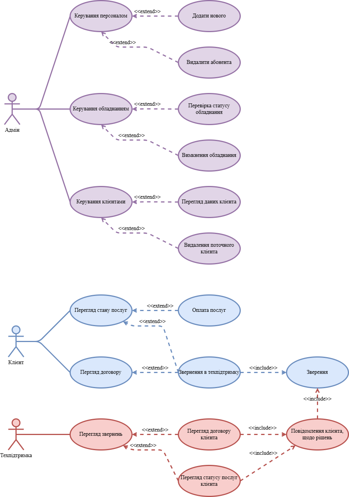

# `🌐 Super-Internet`

Курсова робота (2 курс)

## 📖 Огляд

> Цей проєкт є курсовою роботою — розробкою **прототипу веб-системи** для провайдера телекомунікаційних послуг ("Super Internet"). Проєкт реалізовано з використанням сучасних фронтенд-технологій: **HTML5, CSS3 та JavaScript**. Основна мета — моделювання системи авторизації, особистого кабінету та внутрішніх панелей керування для клієнтів, адміністраторів та служби підтримки.

## 🛠 Технології

| № | Ім'я | Призначення |
| :---: | :---: | :---: |
| 🌐 | HTML5, CSS3, JS | Основні мови веб-розробки (Front-End) |
| 🧱 | ООП на JavaScript | Моделювання сутностей (Користувачі, Контракти) |
| 🚀 | Swiper.js | Бібліотека для створення інтерактивного слайдера на головній сторінці |
| 💅 | Flexbox & Grid | Верстка інтерфейсів |
| 🗃️ | LocalStorage | Імітація бази даних для зберігання даних користувачів та контрактів |
| 🔄 | Git | Система керування версіями |

## 👨‍💻 Автор
:white_check_mark: 👤 Кручкевич Богдан Вікторович

## 📜 Ліцензія

:white_check_mark: Цей проєкт ліцензовано під MIT License. Детальніше дивіться у файлі `LICENSE`.

---

## 📝 Вступ (Огляд Проєкту)

Метою цієї курсової роботи є розробка **прототипу веб-застосунку** для управління телеком-послугами. Система створює єдине середовище для трьох основних груп користувачів: **Клієнтів**, **Служби підтримки** та **Адміністраторів**, кожен з яких має свій функціонал в "Особистому кабінеті".

Для реалізації обрано чистий **JavaScript** з використанням **об'єктно-орієнтованого підходу (ООП)**, що дозволило чітко змоделювати бізнес-сутності: `User`, `Client`, `Support`, `Admin` та `Contract`. Дані зберігаються в **LocalStorage**, що імітує роботу з базою даних і дозволяє швидко перевіряти логіку авторизації та взаємодії.

Інтерфейс розроблено з акцентом на **адаптивність** та **чистоту коду** (CSS3, Flexbox/Grid). Фронтальна частина містить інтерактивний паралакс-слайдер, а особистий кабінет пропонує таб-навігацію та модальні вікна для керування.

## ⚙️ Загальна структура та Архітектура

### 1.1 Аналіз предметної області та ООП

Проєкт моделює роботу ISP (Internet Service Provider) і зосереджений на **трирівневому розмежуванні доступу та функціоналу**:

* **Клієнт:** Перегляд балансу, історії платежів, управління контрактом, звернення до підтримки.
* **Support:** Перегляд активних звернень (тикетів) від клієнтів, можливість відповідати та закривати їх.
* **Admin:** Повне управління системою, включаючи додавання персоналу, моніторинг обладнання та повну інформацію про клієнтів.

**Архітектура (ООП на JS):**

* **Наслідування:** Класи `Client`, `Support`, `Admin` успадковують властивості та методи від базового класу **`User`** (`main.js`).
* **Інкапсуляція/Модульність:** Логіка авторизації, зберігання та оновлення даних користувачів винесена в сервіс **`AuthService`** (використовуючи LocalStorage), що імітує рівень доступу до даних.
* **Моделювання даних:** Сутності `Contract` та `Message` забезпечують чисту структуру даних для бізнес-логіки.

### Функціональні вимоги

| Роль | Функціонал | Реалізація (Файли) |
| :---: | :--- | :--- |
| **Клієнт** | Авторизація/Реєстрація. | `personalAccount.html`, `main.js` |
| | Створення/перегляд контракту. | `main.js` |
| | Поповнення балансу (мокування). | `main.js` |
| | Чат зі Службою підтримки (мокування відповіді). | `main.js` |
| **Support** | Перегляд та керування активними зверненнями (тикетами). | `personalAccount.html`, `main.js` |
| **Admin** | Керування списком клієнтів (перегляд, видалення). | `personalAccount.html`, `main.js` |
| | Керування персоналом (додавання Support/Admin). | `main.js` |
| | Моніторинг обладнання (мокування даних). | `personalAccount.html` |
| **Загальне** | Динамічна зміна інтерфейсу залежно від ролі. | `main.js` |

### Нефункціональні вимоги

* **Розширюваність:** Використання ООП дозволяє легко додавати нові ролі або розширювати функціонал існуючих класів.
* **Сумісність:** Чистий HTML/CSS/JS забезпечує сумісність з будь-яким сучасним браузером.
* **Юзабіліті:** Адаптивний дизайн та інтуїтивно зрозумілий інтерфейс для всіх ролей.
* **Якість коду:** Код JS структурований, з використанням ES6+ синтаксису.

### Рис.1.1 Прецеденти (use cases) системи

### 1.2 Основні функції системи (Деталізація)

1.  **Авторизація та Реєстрація:**
    * Реалізовано на одній сторінці (`personalAccount.html`) з таб-перемиканням.
    * Дані зберігаються у **`localStorage`**.
2.  **Панель Керування Клієнта:**
    * Відображення статусу підключення та даних контракту.
    * Форма для створення нового контракту (якщо його немає).
    * Можливість перегляду балансу та імітація оплати.
3.  **Панель Служби Підтримки:**
    * Динамічне відображення "тикетів" (звернень від клієнтів) у вигляді сітки.
    * Кожне звернення містить email клієнта та час.
4.  **Панель Адміністратора:**
    * Управління клієнтами: перегляд профілю, можливість видалення.
    * Управління персоналом: форма для додавання нових співробітників (Support/Admin).
    * Моніторинг обладнання (імітація заповнення сітки даними).
